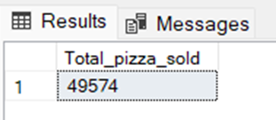

## SQL Results

### Total revenue

### Average Order Value

### Total pizzas sold

### Total Orders

### Average pizzas per order

### Daily trend for total orders

### Monthly trend for total orders

### % of Sales by Pizza Category

### % of Sales by Pizza Size

### Total Pizzas Sold by Pizza Category

### Top 5 Pizzas by Revenue

### Bottom 5 Pizzas by Revenue

### Top 5 Pizzas by Quantity

### Bottom 5 Pizzas by Quantity

### Top 5 Pizzas by Total Orders

### Bottom 5 Pizzas by Total Orders

----

## Power BI Dashboard
 
### Home Page

### Best/Worst Sales Page

